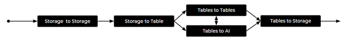

# Overview

## 🔄 What is a data pipeline?

A data pipeline is a series of operations executed sequentially or simultaneously, where the output of one operation is the input of the next one:

Tailer Platform data pipeline operations allow you to connect data sources, consolidate and normalize your data, store them, and feed different tools to obtain analytics, reports and dashboards.

## 🔢 Types of data pipeline operations

Tailer Platform offers the following types of data pipeline operations:

* [Storage to Storage](move-files-with-storage-to-storage/): Move files from one storage to another
* [Storage to Tables](load-data-with-storage-to-tables/): Load data into BigQuery tables
* [Tables to Tables](transform-data-with-tables-to-tables/): Transform data within BigQuery tables
* [Table to Storage](export-data-with-tables-to-storage/): Export data from a table to a storage
* [Workflow](orchestrate-processings-with-workflow/): Trigger the execution of your other data operations

