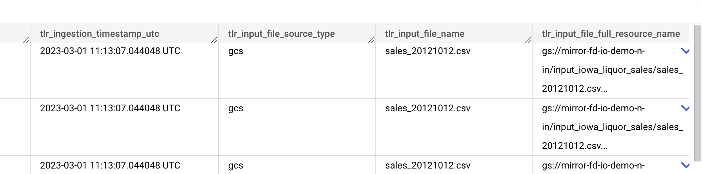

# Tailer SDK API

## How to set your Tailer SDK to use Tailer SDK Staging API


You need to edit your Tailer SDK configuration:

```
tailer config
```

Override the Tailer API Endpoint with the following value:

```
https://fd-io-jarvis-platform-api-proxy-staging-a7nkzexitq-ew.a.run.app
```

<figure><figcaption></figcaption></figure>

Now your Tailer SDK is set to use the Tailer SDK Staging API.


To revert to PRODUCTION, just execute Tailer config again and set the Tailer API Endpoint with the following value:

```
https://fd-io-jarvis-platform-api-proxy-a7nkzexitq-uc.a.run.app
```
