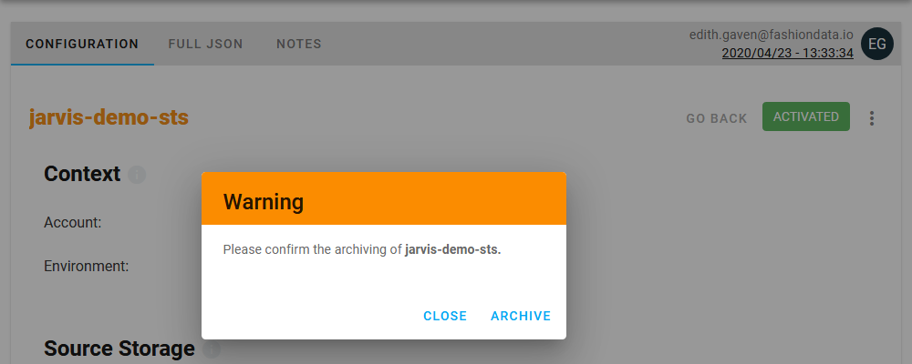

# Archive data operations

## 🗄 What happens when you archive a data operation

Once a data operation has been archived, it disappears completely from Tailer Studio with all its versions. Only super-administrators can still see them, and disarchive them if necessary.

## 🔢 How to proceed

To archive a data operation:

1. Log in to [Tailer Studio](http://studio.tailer.ai/).
2. If necessary, select an account in the drop-down menu at the top of the screen.
3. In the left navigation panel, in the **Data workflows** section, select the [type of your data operation](../data-pipeline-operations/untitled.md#types-of-data-pipeline-operations), \(for example, **Storage to Storage**\).
4. In the right panel, access the **Configurations** tab for data operations or the **Runs** tab for executions.
5. Click the **Configuration id** link corresponding to the data operation or execution of your choice.
6. In the upper right corner of the **Configuration** tab, click the  button, and then **Archive**. A confirmation dialog displays.
7. Click **Archive**.

