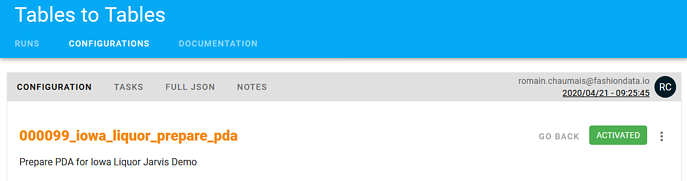
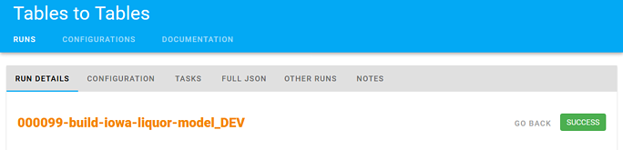

# Check data operations' details

## 📚 Available information

Tailer Studio allows you to display a number of information about the data operations you have deployed using Tailer Platform, and each of their executions.

### **About data operations**

The following information is available about each data operation:

* **Configuration**: Parameters of the data operation JSON configuration file, presented in a user-friendly way.
* **Full JSON**: Whole JSON configuration file, provided when deploying the data operation. For Storage to Tables data operations, you can view the details of the tables created \(DDL file contents, corresponding parameters in the JSON file of the data operation, and Markdown file contents\). For Tables to Tables data operations, you can see a graph illustrating the data operation task sequence, as set in the [task\_dependencies](../data-pipeline-operations/transform-data-with-tables-to-tables/tables-to-tables-configuration-file.md#global-parameters) parameter.
* **Tasks** \(Tables to Tables only\): Information about the tasks that compose the data operation workflow: corresponding parameters in the JSON file of the data operation, contents of the SQL or DDL file, and contents of the associated Markdown file \(**Long description**\). Note: The grayed parameters correspond to the task parameters that were inherited from the data operation global parameters, and not overwritten at task level.
* **Notes**: Comments and answers can be added by users about the data operation in the form of conversations.
* **Version history**: Click the execution date in the upper right corner to display the list of all the data operation versions. Every time the data operation is deployed, a new version is created. You can display each version to see who deployed it and what has changed.

### **About data operations' executions**

A data operation's execution corresponds to an instance of the data operation. Every time a file or a table matching the data operations conditions is found at the specified location, a new execution takes place and displays in Tailer Studio.


By default, only executions from the last two days are displayed. Modify the filters to see more.


The following information is available about each execution of the data operations:

* **Run details**: General information about the execution and the corresponding data operation.
* **Configuration**: Parameters of the corresponding data operation JSON configuration file, presented in a user-friendly way.
* **Tasks** \(Tables to Tables only\): Information about the tasks that compose the data operation workflow: corresponding parameters in the JSON file of the data operation, contents of the SQL or DDL file, contents of the associated Markdown file \(**Long description**\), and logs. Note: The grayed parameters correspond to the task parameters that were inherited from the data operation global parameters, and not overwritten at task level.
* **Full JSON**: Whole JSON configuration file of the data operation.
* **Other runs**: Other executions associated to the same data operation.
* **Notes**: Comments and answers can be added by users about the data operation in the form of conversations.

## 👀 View a data operation's details

To view information about a data operation:

1. Log in to [Tailer Studio](https://jarvis-platform.io/sign-in?redirect=%2F&__hstc=57968821.199e85015347f5cf00c120e5932c4c81.1601276395705.1601460096069.1601469338939.16&__hssc=57968821.8.1601469338939&__hsfp=649433320).
2. If necessary, select an account in the drop-down menu at the top of the screen.
3. In the left navigation panel, in the **Data workflows** section, select the [type of your data operation](../data-pipeline-operations/untitled.md#types-of-data-pipeline-operations), \(for example, **Storage to Storage**\).
4. In the right panel, access:
   * the **Configurations** tab for data operations,
   * the **Runs** tab for data operations' executions,
   * or the **Status** tab to see the data operations triggered by Workflow data operations.
5. Click the **Configuration id** link corresponding to the data operation or execution of your choice
6. Browse the different tabs to display the information that you want.

